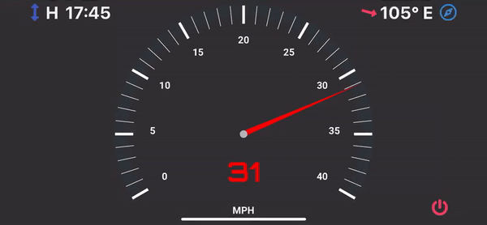
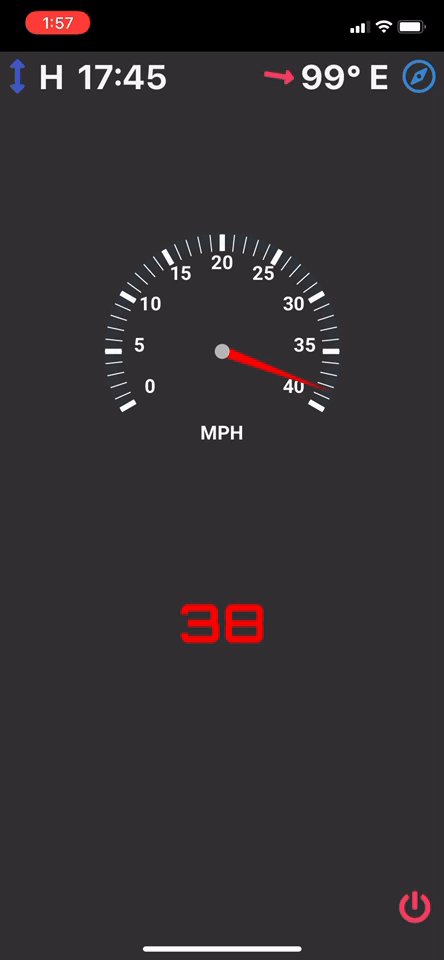
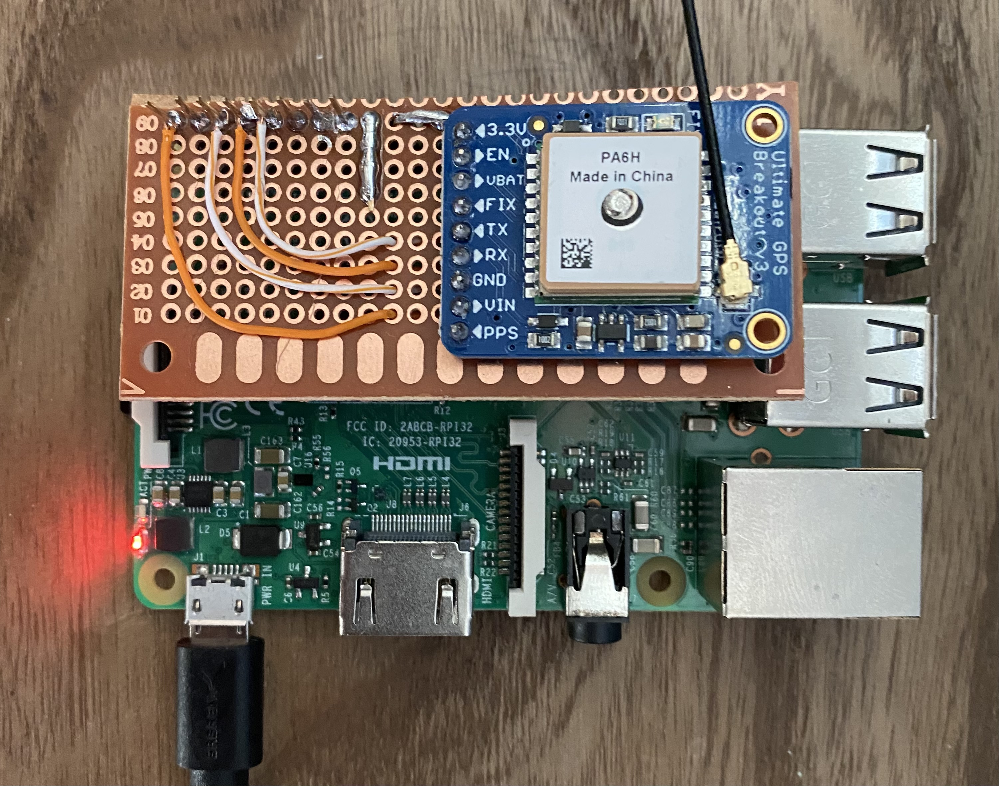

# BoatBuddy
### An open-source boat display cockpit for navigation, speed, heading, and tide tables running on Raspberry Pi and accessible as a webapp through any smartphone.


## Features
- Navigational map showing current location, heading, location history, depths, buoys, and recommended track
- Speedometer showing current speed via GPS satellite data
- Tide table showing high and low tides for next 8 periods
- Standalone access-point and self-hosted -- no internet connection required
- Accessible via any browser @ http://boatbuddy.live with ability for many simultaneous connections
- Bluetooth receiver to connect phones for playing music through Raspberry Pi audio output

<div float="center">
  <div>
  
   
  </div>
  <div>
  
  
    </div
</div>
    

## Parts List
- Raspberry Pi 3b+ || Raspberry Pi 4 || Raspberry Pi Zero 2 
  - Any of these will work. Any Raspberry Pi less powerful is not recommended due to the overhead of the data smoothing algorithm
  - If you choose a Raspberry Pi Zero 2, it will work but the Bluetooth audio function will not since it does not have a 3.5mm Audio Output
- <a href="https://www.adafruit.com/product/746">Adafruit GPS Breakout<a>
- Small wires, solder, soldering iron, etc. to turn the GPS Breakout into a HAT.

## Installation
### Option 1: BoatBuddy Image
This is the easier option and provides all features out of the box. <a href="">At this Google Drive link</a> is a disk image of BoatBuddy. Unzip the file and flash it onto an SD card of sufficient size using the program of your choice (I like Etcher). Once flashed, proceed to the Setup section.

### Option 2: The Hard Way.
1. Clone the repo to your home directory on your Raspberry Pi (structure should look like `/home/pi/BoatBuddy`)
2. Edit the startup file `/etc/rc.local` (`sudo nano /etc/rc.local`) and add these lines before the line `exit 0` to start the webserver and the data collection script on startup. 
    ```
    cd home/pi/BoatBuddy
    python3 manage.py runserver boatbuddy.live:80 &
    python3 data.py &
    ```
4. <a href="https://drive.google.com/file/d/1SMx4_JsFPr93qcJR4syc7A9RtJXIVq5T/view?usp=sharing">Download the zip file containing all of the maptiles</a> (too large to host on Github for free). This is required to host the map offline. Unzip the `ne.zip` file into `boatbuddy/core/static/core` (440k+ individual .pbf files!). The full path on the Raspberry Pi should look like `/home/pi/boatbuddy/core/static/core/ne/...`
5. Install the requirements from the `requirements.txt` file to the global Python libraries: 
    `sudo pip3 install -r requirements.txt`
   - You must run using sudo because the startup script `/etc/rc.local` runs as root on startup.
   - You may get lots of errors here. Hard to predict. Work through them one at a time, and raise an Issue if you need help.

6. Follow this guide through step 5, excluding step 6 and beyond, to set up the Raspberry Pi as an access point: https://thepi.io/how-to-use-your-raspberry-pi-as-a-wireless-access-point/ (we do not want to set up forwarding of the wifi traffic to the ethernet port)

7. Edit the file `/etc/hosts` (`sudo nano /etc/hosts`) and add the below line at the bottom. Replace the IP address with whatever you set as the `static ip_address` when setting up the access point in the `dhcpcd.conf` file. If you followed the steps in the guide exactly, it should be `192.168.0.10`:

   `192.168.0.10     boatbuddy.live`


Note: Bluetooth setup is outside the scope of this installation. It requires an older version of Raspberry Pi OS and an install script from a different Github repo. This can be added later.

## Setup

#### If installed via the flashed image (Installation Option 1):
```
ssh username = pi
ssh password = raspberry
wifi name = BoatBuddy
wifi password = boatbuddy
```

#### If installed manually (Installation Option 2):
Passwords and wifi name could be different. Hope you remembered what you set them to.

### Connecting GPS Module
Wire the GPS module as follows:
<div>

</div>

## Usage

### Connection & Viewing
1. Connect to the BoatBuddy WiFi network and enter password if necessary
2. Navigate to http://boatbuddy.live
3. In order to remove address bar on Apple iOS devices for a "cleaner" look:
   - In Safari and while on the page:
     - Tap the "Share" button on the bottom bar
     - Tap "Add to Home Screen"
     - Tap "Add"
   - The page should now have a shortcut on your homescreen, and will display in an app-like format (without the address bar at the top)

### Functions
Note: all functions work in portrait and landscape mode, but landscape fits the screen better

- Tap the Tide Data icon in the top-left corner to toggle the tide chart 
  - The Tide data button is replaced by the current speed.
  - Tap again to revert back to Speedometer
 
- Tap the Heading icon in the top right corner to toggle to the Map.
  - Use pinching and two-fingers to zoom and spin the view.
  - Tap the Lock button to stop the view from being moved to the current position. Useful for panning around the map.
    - Tap the Unlock button to re-couple the view with the current position.
  - Tap the Route button to toggle on/off the track history (previous route) from view.
  - Tap the Heading again to revert back to the Speedometer (or tide chart -- whichever was displayed last)

- Tap the Power button and confirm to safely shutdown the system

## Configuration
#### The current configuration is for Ocean City, NJ. If you live or boat there, great! You're good to go. To reconfigure for other cities:
##### Changing Tide Data for your location
1. Open `/boatbuddy/Tide Scraping Script/tide_scraper.py` and change the URL and Date variables to your location and desired date range (URL is for api.tidesandcurrents.noaa.gov)
2. Save the output file `tides.csv` into the main /boatbuddy folder replacing the existing file.

##### Changing the default boat location and Home icon location
1. Open the `views.py` file in `/boatbuddy/core/`
2. In the home view, add the coordinates in list form
   - Example `[-75.778, 39.332]`

##### Adding depth soundings, buoys, or other data to the map for a different location:
1. Navigate to the <a href="https://charts.noaa.gov/ENCs/ENCS.shtml">ENC Data from NOAA</a> and download the charts that cover the area you need.
   - Use the <a href="https://charts.noaa.gov/InteractiveCatalog/nrnc.shtml#mapTabs-2">ENC chart locator tool</a> to determine which charts you need.
2. Unzip the downloaded file and upload the spatial data file with file extension .000 to <a href="https://mygeodata.cloud/converter">MyGeoData Cloud Converter</a>
   - Example for `US3SC10M` Spatial Data File would be located in `ENC_ROOT/US3SC10M/US3SC10M.000`
3. Select the output format as GEOJSON and convert your data.
4. Open the `geoconverter.py` file in `/boatbuddy/geojson_formatter/`. Change the `output_name` to any value ending in .json and `input_name` to the file in which you would like to convert.
   - *NOTE* - you may have to change the for-loop dictionary keys to fit the data. It's currently set up to read the `SOUNDG.geojson` file but for other files it will be necessary to tweak.
   - To see a list of the Acronym -> Full Name mappings, visit http://www.s-57.com (for example, depth soundings are contained in the `SOUNDG.geojson` file) 
   - This will convert the GEOJSON data to a slightly different format that is required for MapLibre to display.
6. Save the output file to `/boatbuddy/core/static/core/`
7. Open the `index.html` file at `/boatbuddy/core/templates/` and scroll to the MapLibre Javascript section (starting around line 185)
8. Copy a `map.addSource(...` section up until the semicolon and add it to the list of other `map.addSource(...` sections.
9. Change the name to something unique and change the `"data":` property to refer to your new file
   ```
   map.addSource("US3SC10M_SOUNDG", {
       "type": 'geojson',
       "data": ""
   });
   ```
10. Copy a `map.addLayer(...` section up until the smicolon and add it to the list of other `map.addLayer(...` sections.
11. Change the `"id"` and `"source"` properties to refer back to the source created in step 9, change the `"type"` property to the correct type (depth soundings would be symbols, tracks would be lines, buoys would be symbols etc.) and change the rest of the properties that correspond with your type of layer. 
    ```
     map.addLayer({
        'id': 'US3SC10M_SOUNDG',
        'type': 'symbol',
        'source': 'US3SC10M_SOUNDG',
        layout: {
            'text-field': "{depth}",
            'text-font': ["Open Sans Regular"]
            }
     });
    ```
   *Note* - other types of layers (for lines or for symbols with a picture instead of "text-field" will have different properties in the `map.addLayer(...` function. Refer to the other layers already present on the map or visit the Mapbox documentation (which is the same syntax for MapLibre) for more details.


## How It Works
#### Various technologies, open source repos, and free data were used on this project:
- Django as back-end framework for HTTP server
- Django-Channels for sending GPS data to front-end clients via websockets
- MapLibre for displaying interactive map in Javascript (open source fork of Mapbox)
- Chart.js for tide chart and speedometer gauge display
- Bulma CSS framework for styling
- NOAA ENC data in GeoJSON format for depths, buoy locations, etc.
- Various open-source Python repos used in websocket script for collecting, manipulating, and sending data

## Issues & Troubleshooting
- The site loads but there is no data being sent.
    - Add this line `exec 1>/tmp/rclocal.out 2>&1` to the top of the `/etc/rc.local` file. This will make a log in `/tmp/rclocal.out` where you can investigate the issue futher.
- Map loads but doesn't have any detail on it (city names, streets, etc.).
    - Because of space limitations and the large number of files used by the map tiles at different zoom levels, the map only has detailed information for the North East. Anywhere else (such as Florida or West Coast) will display but not have detailed information. To change this is outside of the scope of this document. Please raise an Issue if you need help setting up a different area of the country.
- Why are you running the default Django http server and not Apache/NGINX/Daphne?
    - A dedicated HTTP server would add an additional layer of abstraction here and additional setup for no gain. Further, the site is "airgapped" and has no connection to the outside world. The security risks here are miniscule. The default Django http server works well in this instance without any further setup required.
