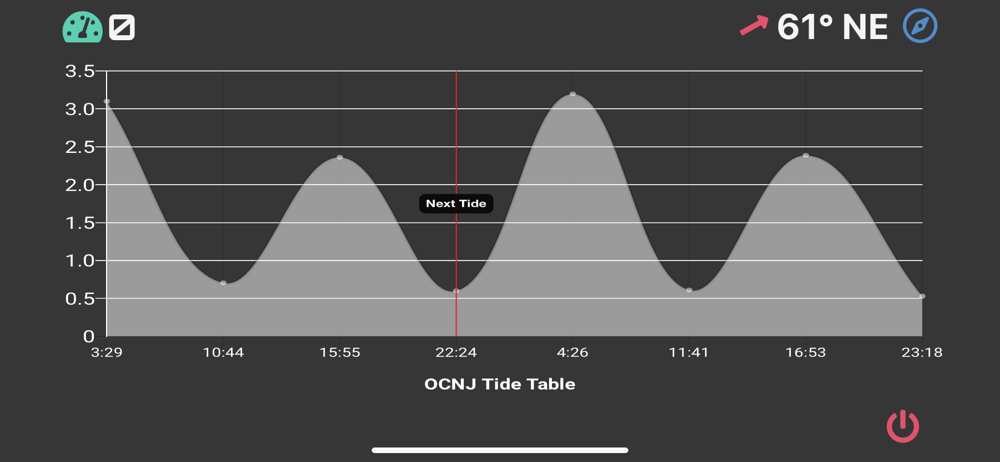

# BoatBuddy
### An open-source boat display cockpit for navigation, speed, heading, and tide tables running on Raspberry Pi and accessible as a webapp through any smartphone.


## Features
- Navigational map showing current location, heading, location history, depths, buoys, and recommended track
- Speedometer showing current speed via GPS satellite data
- Tide table showing high and low tides for next 8 periods
- Standalone access-point and self-hosted -- no internet connection required
- Accessible via any browser @ http://boatbuddy.live with ability for many simultaneous connections
- Bluetooth receiver to connect phones for playing music through Raspberry Pi audio output

<p float="center">
  
   
  
</p>
<p float="center">
    
    
</p>


## Parts List
- Raspberry Pi 3b+ || Raspberry Pi 4 || Raspberry Pi Zero 2 
  - Any of these will work. Any Raspberry Pi less powerful is not recommended due to the overhead of the data smoothing algorithm
  - If you choose a Raspberry Pi Zero 2, it will work but the Bluetooth audio function will not since it does not have a 3.5mm Audio Output
- Adafruit GPS Breakout (https://www.adafruit.com/product/746)
- Small wires, solder, soldering iron, etc. to turn the GPS Breakout into a HAT.

## Installation
### Option 1:
This is the easier option and provides all features out of the box. In the repo is a disk image of BoatBuddy which can be flashed onto an SD card of sufficient size using the program of your choice (I like Etcher). Once flashed, proceed to the Setup section.

### Option 2:
The hard way.
1. Clone the repo and unzip the `boatbuddy.zip` file. Save the /boatbuddy directory to your Raspberry Pi in the /home/pi/ folder (structure should look like /home/pi/boatbuddy)
2. Edit the startup file `/etc/rc.local` (`sudo nano /etc/rc.local`) and add these lines before the line `exit 0` to start the webserver and the data collection script on startup. 
    ```
    cd home/pi/boatbuddy
    python3 manage.py runserver boatbuddy.live:80 &&
    python3 data.py
    ```
    
3. Install the requirements from the `requirements.txt` file to the global Python libraries: 
    `sudo pip3 install -r requirements.txt`
   - You must run as sudo because the startup script `/etc/rc.local` runs as root on startup.
   - You may get lots of errors here. Hard to predict. 

4. Follow this guide through step 5, excluding step 6 and beyond, to set up the Raspberry Pi as and access point: https://thepi.io/how-to-use-your-raspberry-pi-as-a-wireless-access-point/ (we do not want to set up forwarding of the wifi traffic to the ethernet port)

5. Edit the file `/etc/hosts` (`sudo nano /etc/hosts`) and add the below line at the bottom. Replace the IP address with whatever you set as the `static ip_address` when setting up the access point in the `dhcpcd.conf` file. If you followed the steps in the guide exactly, it should be `192.168.0.10`:

   `192.168.0.10     boatbuddy.live`


Note: Bluetooth setup is outside the scope of this installation. It requires an older version of Raspberry Pi OS and an install script from a different Github repo. This can be added later.

## Setup

#### If installed via the flashed image (Installation Option 1):
```
ssh username = pi
ssh password = raspberry
wifi name = BoatBuddy
wifi password = boatbuddy
```

#### If installed manually (Installation Option 2):
Passwords and wifi name could be different. Hope you remembered what you set them to.

### Connecting GPS Module
Wire the GPS module as follows:


## Usage

### Connection & Viewing
1. Connect to the BoatBuddy WiFi network and enter password if necessary
2. Navigate to http://boatbuddy.live
3. In order to remove address bar on Apple iOS devices for a "cleaner" look:
   - In Safari and while on the page:
     - Tap the "Share" button on the bottom bar
     - Tap "Add to Home Screen"
     - Tap "Add"
   - The page should now have a shortcut on your homescreen, and will display in an app-like format (without the address bar at the top)

### Functions
Note: all functions work in portrait and landscape mode, but landscape fits the screen better

- Tap the Tide data button in the top-left corner to toggle the tide chart 
  - The Tide data button is replaced by the current speed. Tap to revert back to Speedometer
 
- Tap the Heading in the top right corner to toggle to the Map.
  - Use pinching and two-fingers to zoom and spin the view.
  - Tap the Lock button to stop the view from being moved to the current position. Useful for panning around the map.
    - Tap the Lock button again to re-couple the view with the current position.
  - Tap the Route button to toggle on/off the track history (previous route) from view.
  - Tap the Heading again to revert back to the Speedometer (or tide chart -- whichever was displayed last)

- Tap the Power button and confirm to safely shutdown the system


## Technologies
#### Various technologies, open source repos, and free data were used on this project:
- Django as back-end framework for server
- Django-channels for sending GPS data to front-end clients via websockets
- MapLibre for mapping (open source fork of Mapbox)
- Bulma CSS framework for styling
- Chart.js for tide chart and speedometer gauge display
- NOAA ENC data in GeoJSON format for depths, buoy locations, etc.
- Various open-source Python repos used in websocket script for collecting and sending data
